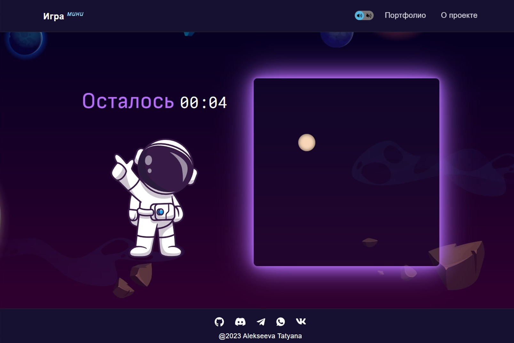
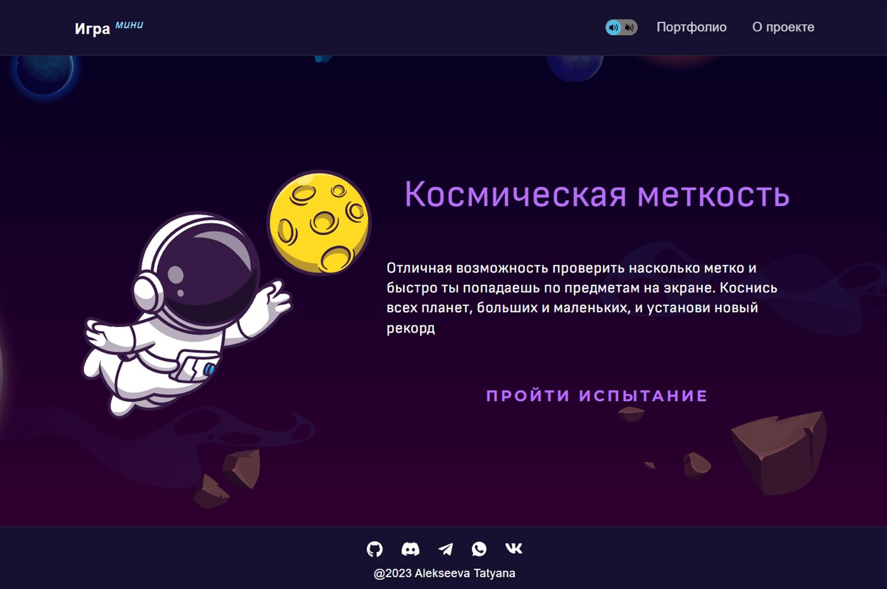

# Игра "Космическая меткость"

Игра тренажер, которая позволяет улучшить навык владения компьютерной мышью и тачпадом. За выбранное время необходимо коснуться, как можно большего количества планет. Игра разработана прежде всего для компьютера или ноутбука, но есть и мобильная версия.

## **Описание проекта**

* Реализован интерфейс игры.
* Есть возможность изменять длительность игры, включать и отключать звук.
* В ходе игры на экране отображаются планеты. Их размер, положение и цвет выбираются рандомно.
* При кликах по игровому полю, если нажатие произошло на планету, увеличивается счет игры.
* Игра завершается, когда изначально заданное время вышло.
* По окончанию игры выводится её результат: количество набранных очков.

## **Стек технологий**

## [**Демо**](https://alekseeva-t-v.github.io/cosmic-accuracy/)
